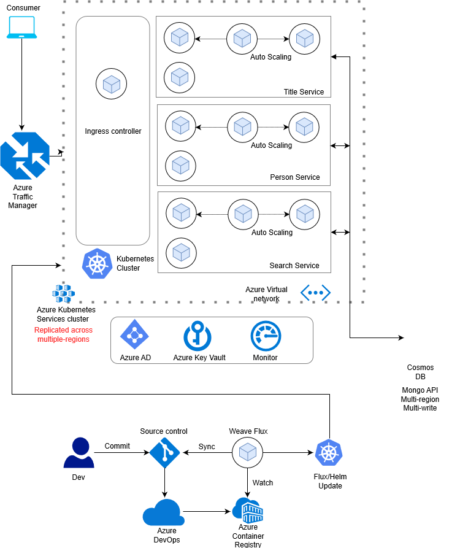

## Quickstart

Following this document to get started on the application, we have in-principle kept the instructions and the code as generic as possible for you to be able to take it and deploy in your own custom application. 

### Deployment Architecture
Following diagram illustrates the architecture of the application that will be deployed on Azure. This is the overall architecture, and may contain components that are currently under development or not implemented yet. Please refer to the [current and planned feature](readme.md#current-and-planned-features) section for more detail.

There are multiple components that constitute the application and the deployment setup. 

* Deployment environment on Azure
* Azure CosmosDB
* Spring boot Java application
* Application build pipeline
* Application deployment-release pipelines (Gitops)

This project is composed of many different pieces - This section is designed to get you up and running as quickly as possible. FOllowing are steps that you can follow to get started.

## Step 1 : Setup Environment Pre-requisites
Before you get started please make sure you have the following pre-requisites setup and installed.

* **Azure Subscription:** Ensure you have a subscription with access to resources listed in the diagram above, and ability to add Service Principals in your Azure Active Directory, or rights to create an Azure Active Directory.

* **Azure CLI:** A lot of our steps to deploy is using the Azure CLI commands and tools. You can install the tool from [here](https://docs.microsoft.com/en-us/cli/azure/install-azure-cli?view=azure-cli-latest), based on your development machine. 

* **kubectl:** Install the kubectl utility to manage kubernetes clusters through command line. You can install kubectl using Azure CLI by following the instructions in this [link](https://docs.microsoft.com/en-us/cli/azure/acs/kubernetes?view=azure-cli-latest).

* **jq utility:** This utility is used in several az commands for ease of querying information, you can skip this if you are comfortable with az commands and their JSON responses. You can install jq from [here](https://stedolan.github.io/jq/)

* **Bash:** If you are on a Windows machine, make sure you have enabled the [Linux sub-system](https://docs.microsoft.com/en-us/windows/wsl/install-win10). Or you could create a Linux Virtual Machine on Azure Subscription and execute the scripts. 

* **Text Editor:** You might be reviewing, editing and modifying yaml, json and other configuration files. It's good to have a editor handy, we love [Visual Studio code](https://code.visualstudio.com/). 

* **Git Repo:** We will be using GitOps to deploy the application on Azure Kubernetes Service. Make sure you have a git repo, either in your enterprise or you could simply have one on [github.com](http://github.com).

## Step 2: Setup Global Resources - Cosmos DB & Azure Traffic Manager
The application will be deployed into three different clusters in three different regions. This will demonstrate deployment across regions, and subsequently testing geo-failovers, performance of load distributed across regions and canary testing. However there will be resources that are access globally, namely 

* **Azure Cosmos DB** , the database will be deployed as a geo-replicated database with multi-region writes enabled. With application deployed in each region prioritizing the writes into that specific region. You can read more around Cosmos DBs' multi-region scale capabilities on [Microsoft docs](https://docs.microsoft.com/en-us/azure/cosmos-db/distribute-data-globally). 
<!-- TODO: Remove comment after benchmarking application goes live There is also a [Cosmos DB](https://github.com/Microsoft/cosmos-benchmarking-lib) which can be used to identify the ideal Cosmos DB setup--> 

* **Azure Traffic Manager**, The traffic manager service will be the front end point that accepts traffic from consumers, traffic will be routed to an application in a region that is closest to the requesting client as well as load on the setup - Performance based routing. You can refer to [Traffic Manager Microsoft docs](https://docs.microsoft.com/en-us/azure/traffic-manager/traffic-manager-routing-methods) to know more about Traffic Manager and its various routing options. 

* **Azure Container Registry (ACR)**, the Azure container registry will be created for holding the application container images. You could potentially use publicly available registries such as Docker. However, for an enterprise grade application we recommend using Azure Container registry that is secured as well as has integration touchpoints with deployment pipelines. To know more about ACR, you can refer to the [Microsoft docs](https://docs.microsoft.com/en-us/azure/container-service/). 

#### Please go through the setup instructions in Global Resources [Readme.md](infrastructure/global-resources/readme.md)  to deploy the three resources into your Azure Subscription. Also, import IMDB data into the created Azure Cosmos DB.

## Step 3: Deploy Infrastructure on Azure through ARM Template
The Azure Resource Manager (ARM) enables provisioning resources on Azure. The ARM template currently deploys all the needed resources within a specified region. You will need to deploy the template in all the regions you would want to deploy the application to. 
#### Following the setup instructions on [infrastructure readme.md](infrastructure/readme.md) for step by step creation of regional resources.

## Step 4: Setup & run Build Pipeline
Once the resources have been created, you will be setting up a build pipeline that automates compiling and building of the application, creation of an image and pushing the updated image in the Azure Container Registry Service.

#### Follow the instructions on [the API Readme.md](./api/README.md)

## Step 5: Setup & run Deployment Pipeline
This application deploys GitOps for building the Release Pipeline. The release pipeline can also be built using Azure DevOps. We decided to adopt the GitOps framework as it provides additional benefits of tracking the changes in infrastructure through git.  The overview section has reference links as well as brief introduction to GitOps. 

The current set of instructions is and we will be adding an automated shell script.

#### Follow the instructions on [Gitops Readme.md](gitops/readme.md).

## Step 6: Update Traffic Manager & Cosmos DB endpoints
Once you have created and deployed the application across all regions you will need to update the traffic manager's endpoints to point to the application end-points in all three regions. You can do that by deploying the [endpoint_deploy.json](infrastructure/global-resources/readme.md#traffic-manager-endpoints) template.

Also, additionally the CosmosDB can be integrated with the Virtual Network endpoints for all the Virtual networks in the three regions. This will limit access to the CosmosDB database only to the clusters deployed in the Virtual selected networks. You can do that by following simple steps on the [portal](https://docs.microsoft.com/en-us/azure/cosmos-db/how-to-configure-vnet-service-endpoint).

**Note**: You can limit to one region as well, and skip the Azure Traffic manager all together.

