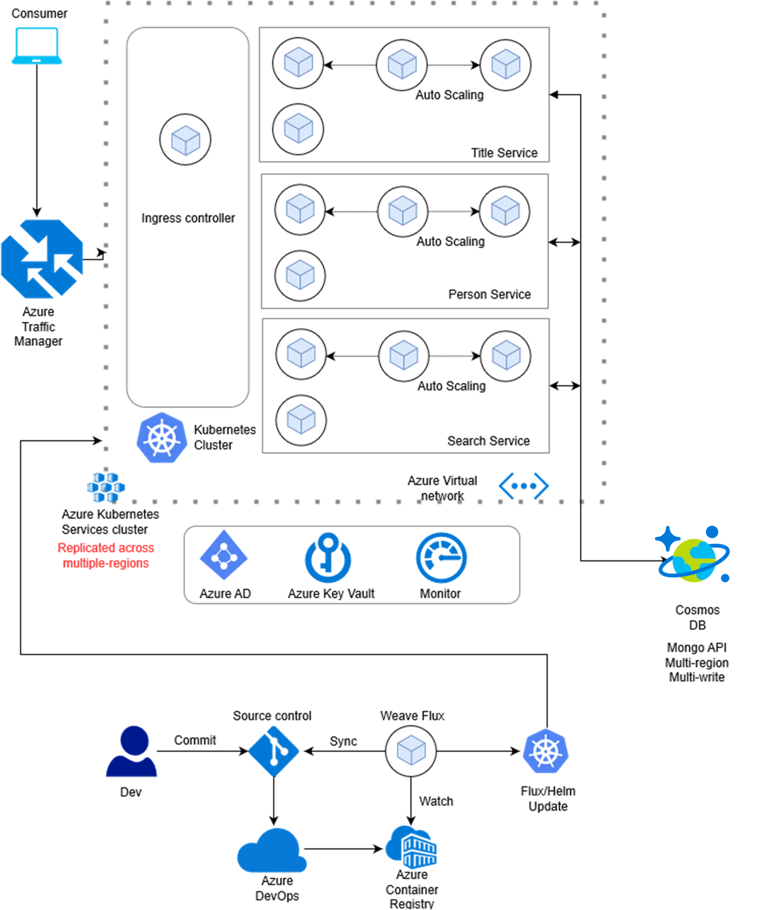

## Quickstart

Following this document to get started on the application, we have in-principle kept the instructions and the code as generic as possible for you to be able to take it and deploy in your own custom application. 

### Deployment Architecture
Following diagram illustrates the architecture of the application that will be deployed on Azure. This is the overall architecture, and may contain components that are currently under development or not implemented yet. Please refer to the [current and planned feature](readme.md#current-and-planned-features) section for more detail.

There are multiple components that constitute the application and the deployment setup. 

* Deployment environment on Azure
* Azure CosmosDB
* Spring boot Java application
* Application build pipeline
* Application deployment-release pipelines (Gitops)

This project is composed of many different pieces - This section is designed to get you up and running as quickly as possible.

* The largest component of this service is the Java Backend - see [the Backend Readme](./api/README.md)
* To scale our service on Azure, we leverage ARM templates - see [the Infrastructure Readme](./infrastructure/README.md)

